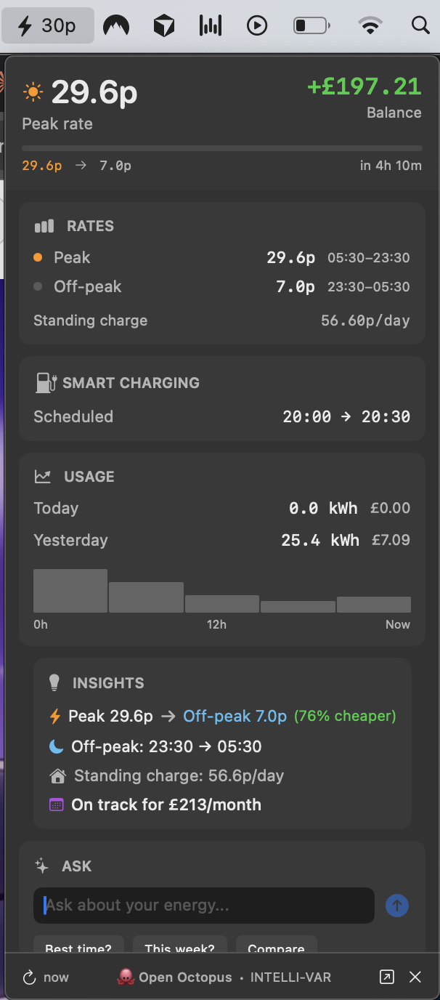

# 🐙 Open Octopus

> **Unofficial** open-source toolkit for [Octopus Energy](https://octopus.energy) customers.
> Not affiliated with or endorsed by Octopus Energy.



## What's Included

| Component | Description |
|-----------|-------------|
| **Menu Bar App** | Native macOS app with live rates, usage, insights |
| **CLI Tools** | Terminal commands for quick access to your data |
| **TUI** | Interactive terminal dashboard |
| **AI Assistant** | Ask questions about your energy usage |
| **Alerts** | Notifications for rate changes, charging, sessions *(coming soon)* |

## Features

### Menu Bar App (macOS)
- Live rate display with countdown to off-peak
- Smart charging status with golden indicator when EV is charging
- Usage sparkline with off-peak hour highlighting
- Rate comparison (peak vs off-peak savings)
- Monthly cost projection
- AI chat with quick action buttons

### CLI Tools
```bash
octopus rate       # Current electricity rate
octopus account    # Account balance
octopus usage      # Consumption data
octopus dispatch   # EV charging schedule
octopus power      # Live power (if available)
octopus sessions   # Saving sessions
```

### TUI (Terminal UI)
```bash
octopus tui        # Interactive dashboard
```

### AI Assistant
```bash
octopus-ask "What's the best time to run my dishwasher?"
octopus-ask "How much did I spend this week?"
octopus-ask "Compare my usage to last month"
```

## Installation

```bash
pip install open-octopus
```

### Configuration

Set your credentials:
```bash
export OCTOPUS_API_KEY="sk_live_xxxxx"
export OCTOPUS_ACCOUNT="A-XXXXXXXX"
export OCTOPUS_MPAN="1234567890123"        # For consumption data
export OCTOPUS_METER_SERIAL="12A3456789"   # For consumption data
export ANTHROPIC_API_KEY="sk-ant-xxxxx"    # For AI features
```

Or create `~/.octopus.env`:
```bash
OCTOPUS_API_KEY=sk_live_xxxxx
OCTOPUS_ACCOUNT=A-XXXXXXXX
OCTOPUS_MPAN=1234567890123
OCTOPUS_METER_SERIAL=12A3456789
ANTHROPIC_API_KEY=sk-ant-xxxxx
```

### Menu Bar App (macOS)

```bash
git clone https://github.com/abracadabra50/open-octopus.git
cd open-octopus
xcodebuild -workspace OctopusMenuBar.xcworkspace -scheme OctopusMenuBar build
open ~/Library/Developer/Xcode/DerivedData/OctopusMenuBar-*/Build/Products/Debug/OctopusMenuBar.app
```

## Supported Tariffs

- Intelligent Octopus Go
- Octopus Go
- Agile Octopus
- Flexible Octopus
- Tracker
- And more...

## Roadmap

- [ ] **Alerts** - macOS notifications for:
  - Off-peak rate starting/ending
  - EV dispatch starting/ending
  - Saving sessions
  - Low balance warning
- [ ] **Widgets** - macOS desktop widgets
- [ ] **Gas support** - Full gas meter integration
- [ ] **Historical charts** - Weekly/monthly usage graphs

## License

MIT

## Credits

Built with Python and SwiftUI. AI powered by [Claude](https://anthropic.com).
